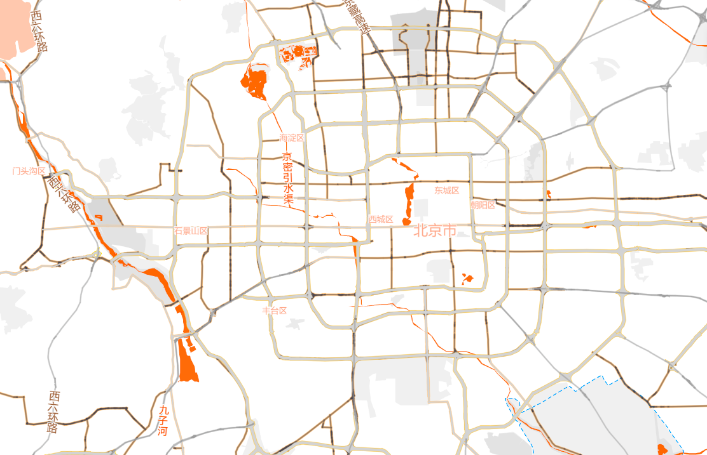
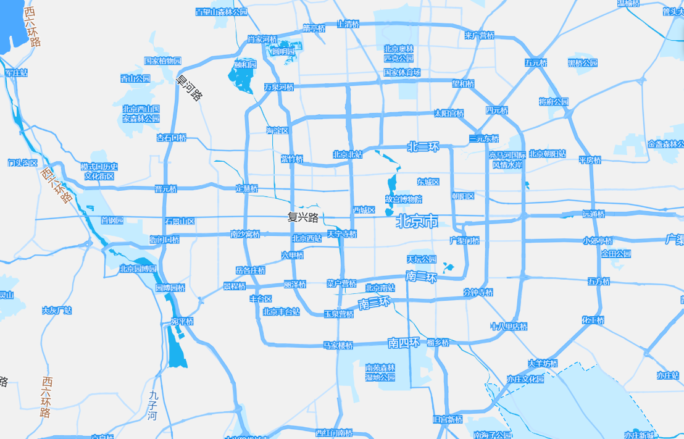
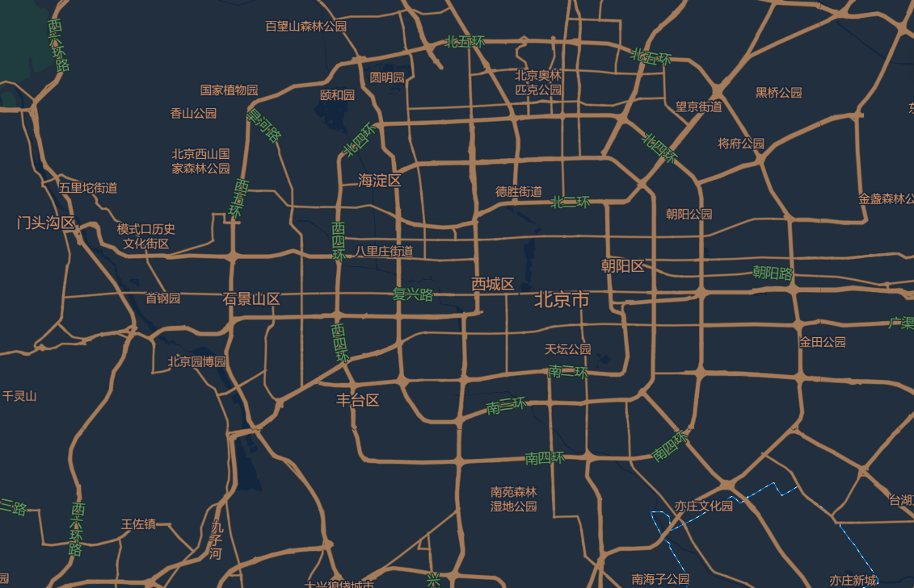
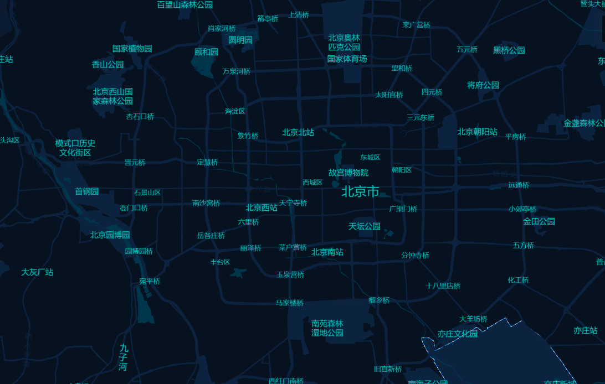

# 自定义地图样式


> 还在为地图样式与集成烦恼？我们为您提供专业的数据支持。

## ✨ 特性

- ✅ 自由定制地图风格，匹配您的品牌与场景
- 🚀 一键导出通用瓦片，OpenLayers、Leaflet等框架直接调用
- 🔧 无需ArcGIS等专业软件，免去复杂服务搭建
- 📦 专业配色服务，让大屏地图既精准又惊艳
> 让地图集成，从此简单、专业、出彩！
## 📸 预览






### 安装

```bash
# 克隆项目
git clone https://github.com/Mazh1/custom-map-style.git

# 进入目录
cd custom-map-style

# 安装依赖
npm install
# 运行
npm run dev

### 联系方式
> 有需要的可以添加微信，我们将为您提供专业的服务

